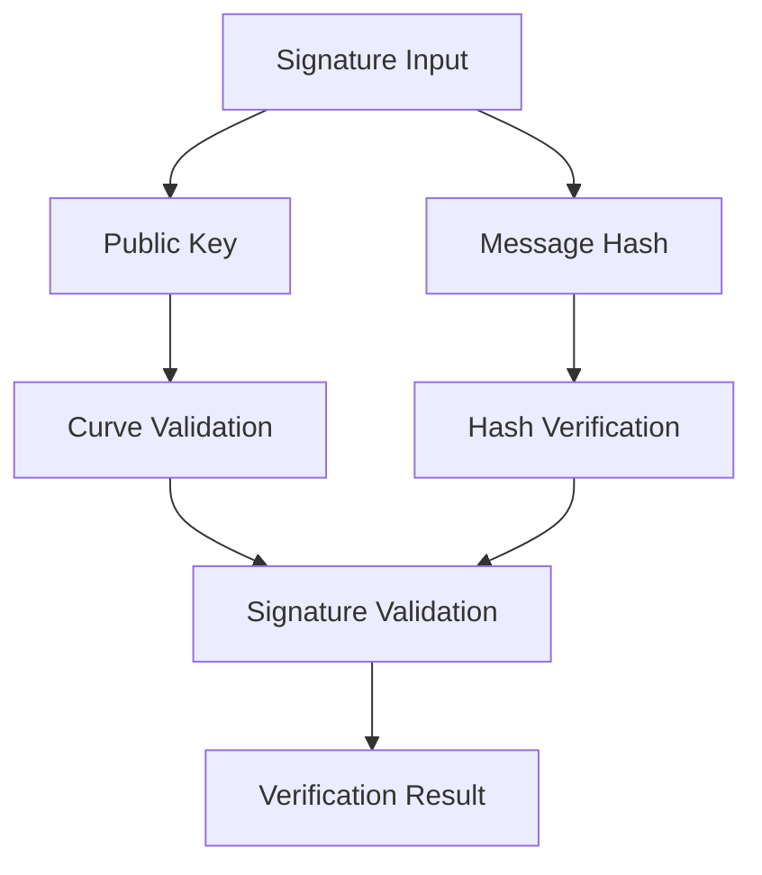

# Proven ECDSA Schema

A robust Clarity smart contract for secure ECDSA signature verification and cryptographic validation on the Stacks blockchain.

## Overview

The Proven ECDSA Schema provides:
- Cryptographically secure signature verification
- Support for ECDSA signature validation
- Flexible public key and signature handling
- Immutable on-chain cryptographic operations
- Advanced signature integrity checks

## Architecture

The contract implements a comprehensive ECDSA verification workflow:



Core Components:
- Signature Validation: Cryptographic signature verification
- Public Key Management: Handling different key formats
- Hash Processing: Secure hash input validation
- Error Handling: Comprehensive error codes for verification failures

## Contract Documentation

### Main Contract: ecdsa-verification.clar

#### Error Constants
- `ERR-INVALID-SIGNATURE` (100)
- `ERR-INVALID-PUBLIC-KEY` (101)
- `ERR-INVALID-HASH` (102)
- `ERR-SIGNATURE-VERIFICATION-FAILED` (103)
- `ERR-UNSUPPORTED-CURVE` (104)
- `ERR-INVALID-SIGNATURE-LENGTH` (105)
- `ERR-SIGNATURE-ALREADY-USED` (106)

## Getting Started

### Prerequisites
- Clarinet for development and testing
- Understanding of ECDSA cryptography
- Stacks wallet for contract interaction

### Usage Examples

1. Verify ECDSA Signature:
```clarity
(contract-call? .ecdsa-verification verify-signature 
    signature-bytes 
    public-key-bytes 
    message-hash)
```

2. Validate Public Key:
```clarity
(contract-call? .ecdsa-verification validate-public-key 
    public-key-bytes 
    curve-type)
```

## Function Reference

### Signature Verification

```clarity
(verify-signature 
    (signature (buff 64)) 
    (public-key (buff 33)) 
    (message-hash (buff 32)))

(validate-public-key 
    (public-key (buff 33)) 
    (curve-type uint))
```

## Development

### Testing
1. Clone the repository
2. Install dependencies: `clarinet install`
3. Run tests: `clarinet test`

### Local Development
1. Start local chain: `clarinet console`
2. Deploy contract
3. Test cryptographic operations

## Security Considerations

1. Cryptographic Validation
- Comprehensive signature verification
- Multiple error states for security
- Strict input validation

2. Performance Optimization
- Efficient cryptographic checks
- Minimal computational overhead
- Constant-time verification algorithms

3. Limitations
- Fixed signature and key length requirements
- Support for specific ECDSA curves
- On-chain computational constraints